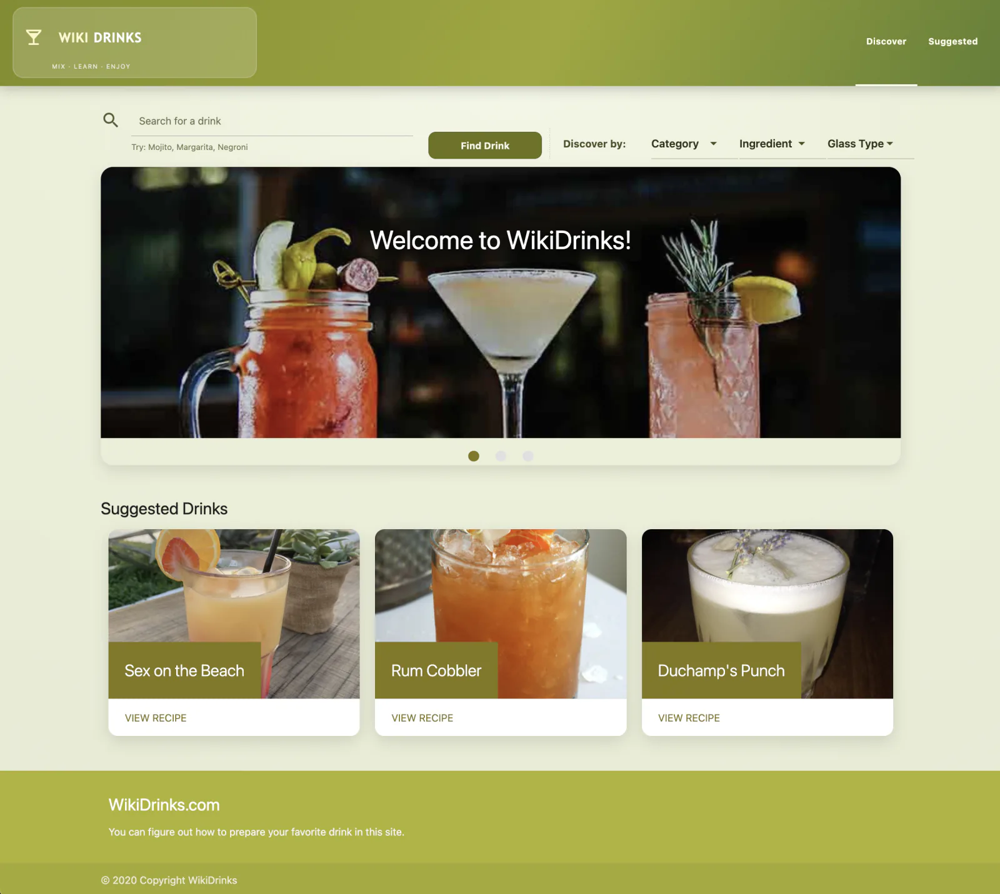

# 🍸 WikiDrinks

### Discover a cocktail, learn how to make it, and get a little reading on the side.

WikiDrinks is a single-page cocktail finder that mixes recipe search, ingredient-driven discovery, and fun step-by-step prep visuals. It now runs with a simple Express server so API keys stay on the server and out of the frontend.

---

## ✨ Features

| | Feature | Why It Helps |
|---|---|---|
| 🔎 | Drink search by name | Quickly look up classics or whatever you are craving. |
| 🎛️ | Discovery filters (category, ingredient, glass) | Helps users find something new without knowing a drink name first. |
| 🥃 | Ingredient image carousel | Makes each recipe easier to scan and more visual. |
| 🧪 | Step-by-step preparation panel | Breaks instructions into readable steps instead of one long paragraph. |
| 🎞️ | Giphy-powered prep GIF matching | Adds visual cues to preparation steps for a more interactive experience. |
| 📰 | NYT article recommendations + random drink suggestions | Keeps the page dynamic with related reading and fresh drink ideas. |

---

<p align="center">
  
</p>

---

## 🛠️ Tech Stack


---

## 🧩 Project Snapshot

- `server.js` runs a small Express app that serves the site and proxies Giphy + NYT requests using server-side env vars.
- `public/index.html` contains the full UI layout: search/filter controls, intro slider, selected drink view, ingredients carousel, preparation steps, articles, and suggested drinks.
- `public/front.js` handles AJAX requests, UI state toggling, filter actions, random suggestions, and section updates.
- The app uses TheCocktailDB directly for recipes, and uses Express proxy endpoints for Giphy + NYT so keys are not exposed in the browser.
- `public/frontStyle.css` provides the custom olive-themed UI, responsive navigation, mobile breakpoints, and scroll-to-top interactions.

---

## 🚀 Live Demo


[](https://github.com/jorguzman100/wikidrinks)

No public deployment yet. Local run is the way to go for now.

---

## 💻 Run it locally

This project now uses a simple Express server.

```bash
git clone https://github.com/jorguzman100/wikidrinks.git
cd wikidrinks
npm install
cp .env_example .env
# add your real keys to .env
npm start
```

Open:

- `http://localhost:3000`

<details>
<summary>🔑 Environment variables</summary>

Copy the example file and add your keys:

```bash
cp .env_example .env
```

```env
PORT=3000
GIPHY_API_KEY=your_giphy_api_key
NYT_API_KEY=your_nyt_article_search_api_key
```

`.env` is ignored by git, so your real keys are not committed.

These keys are used by `server.js` (Express), not by the frontend files in `public/`.

</details>


---

## 🤝 Contributors

- **Raul Alarcon**  ·  [@raul-ae](https://github.com/raul-ae)
- **Rodrigo Rosas**  ·  [@rodrigorosasv](https://github.com/rodrigorosasv)
- **Jorge Guzman**  ·  [@jorguzman100](https://github.com/jorguzman100)
